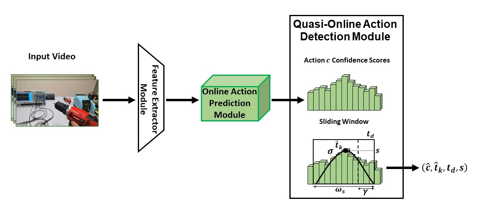

<h1 align="center">
  Quasi-Online Detection of Take and Release Actions from Egocentric Videos
</h1>

<h3 align="center">
<a href="https://www.linkedin.com/in/rosarioscavo/">Rosario Scavo</a>, 
<a href="https://francescoragusa.github.io/index.html">Francesco Ragusa</a>, 
<a href="https://www.antoninofurnari.it/">Antonino Furnari</a>,
<a href="https://www.dmi.unict.it/farinella/">Giovanni Maria Farinella</a>
</h3>





Code for the Paper: Quasi-Online Detection of Take and Release Actions from Egocentric Videos. International Conference on Image Analysis and Processing 2023.

Find the original paper [here](https://iplab.dmi.unict.it/fpv/publications/scavo2023Quasi-Online.pdf).

# Citations
If you use the data, code, or model provided here in your publication, please cite our paper.
```
@inproceedings{scavo2023quasi,
  title={Quasi-Online Detection of Take and Release Actions from Egocentric Videos},
  author={Scavo, Rosario and Ragusa, Francesco and Farinella, Giovanni Maria and Furnari, Antonino},
  booktitle={International Conference on Image Analysis and Processing},
  pages={13--24},
  year={2023},
  organization={Springer}
}
```

# Table of Contents

* [Introduction](#introduction)
* [Installation](#installation)
* [Data Preparation](#data-preparation)
* [Evaluation](#evaluation)


## Introduction
This repository contains the code for the quasi-online action detection module of the paper "Quasi-Online Detection of Take and Release Actions from Egocentric Videos".

The ENIGMA-51 dataset has been released, you can find the paper [here](https://arxiv.org/abs/2309.14809) and the project page [here](https://iplab.dmi.unict.it/ENIGMA-51/#dataset). We have also a repository on Github, go [check it out](https://github.com/fpv-iplab/ENIGMA-51).


Our Online Action Prediction module is based on [TeSTra](https://github.com/zhaoyue-zephyrus/TeSTra), refer to the original repository for more information and instructions.


## Installation

To set up the environment for this project, you can use either `pip` or `Conda`.

### Using pip
If you prefer using `pip`, you can install the required packages by running the following command:

```bash
pip install -r requirements.txt
```

### Using Conda
Alternatively, you can use `Conda` to create an environment with the necessary dependencies. First, create the environment using the `requirements.txt` file:

```bash
conda create --name <env_name> --file requirements.txt
```

If you encounter any issues, try adding the `conda-forge` channel to your list of channels:

```bash
conda config --append channels conda-forge
```

This will instruct `Conda` to search for packages on the `conda-forge` channel as well.

### Creating an Environment from a .yml File
You can also create a Conda environment directly from the `environment.yml` file:

```bash
conda env create --name environment_name --file environment.yml
```

Replace `<env_name>` and `environment_name` with your desired environment names. This will set up all necessary dependencies as specified in the configuration files.

<br>

## Data Preparation

We provide the checkpoint of TeSTra for the THUMOS dataset, which can be downloaded from [here](https://iplab.dmi.unict.it/sharing/quasi-online/testra_th14_long_512_work_8_box.epoch-15.pth) and placed inside the `data/TeSTra/THUMOS/checkpoints/` folder. This step is not mandatory if you only want to test the quasi-online action detection module. Use the configuration file `config/TeSTra/THUMOS/testra_long_512_work_8_kinetics_1x_box` to run the TeSTra network on the THUMOS dataset.

We also provide ground truth action starts, predictions from the TeSTra network, and results from the model experiments for both the THUMOS and ENIGMA datasets. Download these files from [here](https://iplab.dmi.unict.it/sharing/quasi-online/data_qoad.tar.gz) and place them in the `data/` folder.

The structure of the `data/` folder should look like this:

```
Quasi-Online-Detection-Take-Release 
│
├── data/
│   ├── TeSTra/
│       ├── THUMOS/
│           ├── checkpoints/
│               ├── testra_th14_long_512_work_8_box.epoch-15.pth
│               ├── testra_th14_long_512_work_8_box.epoch-15.txt
│   ├── gt_action_starts/
│       ├── enigma_gt_action_starts.pkl
│       ├── thumos_gt_action_starts.pkl
│   ├── predictions/
│       ├── enigma_predictions.pkl
│       ├── thumos_predictions.pkl
│   ├── model_experiments/
│       ├── ENIGMA/
│           ├── enigma_results.csv
│           ├── test_ws5_it0_s1_md10.pkl
│           ├── test_ws5_it0_s2_md10.pkl
│           ├── ...
│       ├── THUMOS/
│           ├── thumos_results.csv
│           ├── test_ws4_it0_s1_md8.pkl
│           ├── test_ws4_it0_s2_md8.pkl
│           ├── ...
│
├── ...
```
<br>

## Evaluation

To evaluate the quasi-online action detection module, you can use the `main.py` script. The script supports different modes of operation: `single_test`, `grid_search`, and `performance_over_latency`. Each mode corresponds to a specific evaluation scenario.

To run a single test using the default configuration, use the following command:

```bash
python main.py --config_path config/enigma_config.yaml --mode single_test
```

This command will use the configuration file specified in `config/enigma_config.yaml` to perform a single test evaluation using the parameters defined in the configuration file.

The `--mode` argument determines the mode of operation. Depending on the mode specified, it will then execute the corresponding evaluation function:
- **single_test**: Evaluate the model using a single set of parameters defined in the configuration file.
- **grid_search**: Perform a grid search over different parameter sets defined in the `src/run_tests.py` file.
- **performance_over_latency**: Evaluate the model's performance against different latency thresholds, as defined in the `src/run_tests.py` file.

<br>

For more information on the configuration parameters, refer to the `config/config_loader.py` file. This file provides detailed documentation on how to set up your configuration file to match your specific needs. By following these instructions, you can easily evaluate the quasi-online action detection module with different settings and datasets.